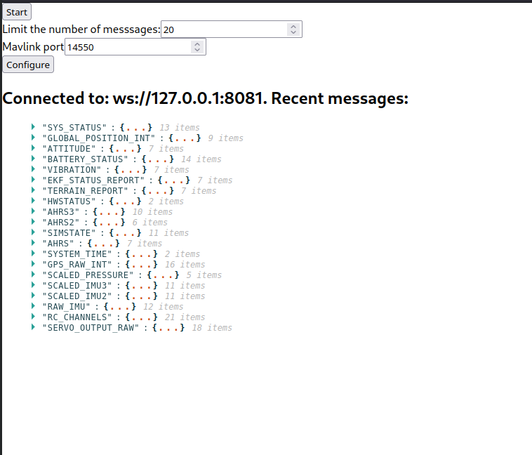

## Architecture

This application consists of a backend and a frontend application.

The backend application is an ExpressJS server which serves multiple purposes:

- Serve the frontend application static assets
- Implement an API endpoint (`/configure`) which can be used to reconfigure the Mavlink connection
- Implement a websocket server, which is used to send Mavlink messages to the frontend
- Implement Mavlink message handling on UDP port

The backend application is implemented in a single file: `index.ts` in the root of this package.

The frontend application is a React application in the `frontend` folder of this package. It connects to the backend via websocket and displays any received Mavlink message on the UI. The json objects are displayed using a component called `ReactJson` instead of simple text so it is easy to view the messages.

The frontend application has a few configuration options:

- Start/Pause the messages: There are a lot of messages coming from the devices. With Pause it is easier to stop the message flow to inspect the messages
- Limit: limit the number of messages displayed: This is added for performance reasons (too many displayed messages may slow down the browser)
- Mavlink port: mavproxy sends the messages on UDP to specific ports. With this property we can change the port to listen on.

## Run locally

### Requirements

- NodeJs 14 or above
- NPM

### How to run?

Install backend dependencies:

```
$ cd mavlink-app
$ npm install
```

Install frontend dependencies

```
$ cd mavlink-app/frontend
$ npm install
```

Finally, run the application

```
$ cd mavlink-app
$ npm start
```

Now open a browser an navigate to [http://localhost:8080](http://localhost:8080)

## Run with docker

### Requirements

- Latest Docker version

### How to run?

Build with docker:

```
$ docker build . -t mavlink-app
```

Set environment variables:

```
export APPMODE=prod
export MAVLINK_PORT=14550
export GOOGLE_API_KEY=<API key>
export GOOGLE_MAP_ID=<Map ID>
```

Note: to start the app in *demo* mode use APPMODE=demo.
In this mode the backend will not listen to Mavlink port and instead will
generate fake SIMSTATE and GLOBAL_POSITION_INT messages and send them to all clients.

Run the container:

```
$ docker run -p 8080:8080 -p 8081:8081 --net="host" \
  -e APPMODE -e MAVLINK_PORT \
  -e GOOGLE_API_KEY -e GOOGLE_MAP_ID \
  mavlink-app
```

## Verification

To verify that the app is working properly, we also need to run the mavlink simulator.

First checkout the repository: [https://gitlab.com/tc-ngcs/docker-env](https://gitlab.com/tc-ngcs/docker-env) and run the following commands to start the simulator:

```
$ docker-compose build
$ docker-compose run ardupilot -v ArduCopter --out 127.0.0.1:15000 -l -35.363536,149.164933,10,0 -S 1 -I 0 -w
```

Then start this application manually with one of the methods mentioned above (running locally or running in Docker).

Example: 
